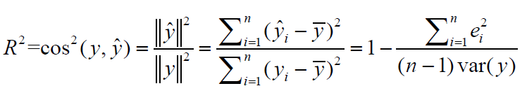

```{=html}
<style type="text/css">
.main-container {
  max-width: 1500px;
  margin-left: auto;
  margin-right: auto;
}
</style>
```

------------------------------------------------------------------------

## Ejercicio 1

**Enumere cuales son las hipótesis que asumimos al hacer una regresión múltiple entre una variable de respuesta y y unas variables predictoras, x1, ..., xp.**

-   En el modelo de regresión lineal múltiple se supone que la función de regresión que relaciona la variable dependiente con las variables independientes es lineal.

-   Asumimos que los errores ε1, ε2, . . . , εn tienen distribución normal de media cero y varianza σ2, y que son independientes.

-   Las variables explicativas son linealmente independientes entre si.

## Ejercicio 2

**En un modelo de regresión, como se calcula y como se interpreta el coeficiente de determinación R2.**

R2 se interpreta como un coeficiente o proporcion de la variabilidad de la variable de respuesta explicada por el modelo (en otras palabras, que tanto explica el vector de ajuste al vector respuesta).

Valores de R que se aproximen a:

-   1 indican ajustes perfectos,

-   entre 0.4 y 0.7 son ajustes medianos

-   menores a 0.4 son ajustes bajos

-   cercanos a 0 son inservibles.

Se calcula a través del coseno cuadrado entre la variable respuesta y la variable predictora, o lo que es lo mismo:

{width="376"}

## Ejercicio 3

**Lea el fichero "BCN_pisos.txt". Del fichero resultante seleccione 2/3 partes como muestra de training y la tercera parte restante como muestra test.**

```{r}
pisos_bcn = read.delim("bcn_pisos.txt")
length = nrow(pisos_bcn)
number_training_rows =  round(length / 3) * 2

training = pisos_bcn[0:number_training_rows,]
test = pisos_bcn[number_training_rows:length-1,]

```

## Ejercicio 4

**Con la muestra de training, efectúe la representación gráfica de la variable "Valor" respecto del resto de variables del fichero. Calcule la correlación entre la variable "Valor" y el resto de variables numéricas.**

```{r}
library(ggplot2)

colorPalett = c("#99E47E", "#48BF84", "#439775", "#3C7A80", "#D65F65")
correlation = round(cor(training$Valor, training$Superf),3)
value_vs_super = ggplot(training, aes(y = Valor, x = Superf, group = 1)) + geom_point(color = "#48BF84", size =1.2) + geom_smooth(method='lm', se = FALSE) + theme(axis.text.x = element_text(angle = 90, vjust = 0.5, hjust=1)) + ggtitle(paste("Valor Pisos por Superficie, con una correlación: ", correlation)) + labs(y = "Valor Ptas", x = " Superf") + scale_fill_manual(values=colorPalett)
print(value_vs_super)

correlation = round(cor(training$Valor, training$Dorm),3)
value_vs_dorm = ggplot(training, aes(y = Valor, x = Dorm, group = 1)) + geom_point(color = "#48BF84", size =1.2) + geom_smooth(method='lm', se = FALSE) + theme(axis.text.x = element_text(angle = 90, vjust = 0.5, hjust=1)) + ggtitle(paste("Valor Pisos por Dorm, con una correlación: ", correlation)) + labs(y = "Valor Ptas", x = " Dorm") + scale_fill_manual(values=colorPalett)
print(value_vs_dorm)

correlation = round(cor(training$Valor, training$Banys),3)
value_vs_banys = ggplot(training, aes(y = Valor, x = Banys, group = 1)) + geom_point(color = "#48BF84", size =1.2) + geom_smooth(method='lm', se = FALSE) + theme(axis.text.x = element_text(angle = 90, vjust = 0.5, hjust=1)) + ggtitle(paste("Valor Pisos por Banys, con una correlación: ", correlation)) + labs(y = "Valor Ptas", x = " Banys") + scale_fill_manual(values=colorPalett)
print(value_vs_banys)

correlation = round(cor(training$Valor, training$Edat),3)
value_vs_edat = ggplot(training, aes(y = Valor, x = Edat, group = 1)) + geom_point(color = "#48BF84", size =1.2) + geom_smooth(method='lm', se = FALSE) + theme(axis.text.x = element_text(angle = 90, vjust = 0.5, hjust=1)) + ggtitle(paste("Valor Pisos por Edat, con una correlación: ", correlation)) + labs(y = "Valor Ptas", x = " Edat") + scale_fill_manual(values=colorPalett)
print(value_vs_edat)

correlation = round(cor(training$Valor, training$ValSol),3)
value_vs_valsol = ggplot(training, aes(y = Valor, x = ValSol, group = 1)) + geom_point(color = "#48BF84", size =1.2) + geom_smooth(method='lm', se = FALSE) + theme(axis.text.x = element_text(angle = 90, vjust = 0.5, hjust=1)) + ggtitle(paste("Valor Pisos por ValSol, con una correlación: ", correlation)) + labs(y = "Valor Ptas", x = " ValSol") + scale_fill_manual(values=colorPalett)
print(value_vs_valsol)

```

Aunque al realizar la representación gráfica, ya hemos visto la **cor** del valor con su respectiva variable, ahora realizaremos una tabla comparativa de correlaciones.

```{r}
library(corrplot)
df_numeric_variables = data.frame('valor' = training$Valor,
                                  'superf' = training$Superf,
                                  'dorm' = training$Dorm,
                                  'banys' = training$Banys,
                                  'edat' = training$Edat,
                                  'valsol' = training$ValSol)
R = cor(df_numeric_variables)
corrplot(R,method='number')
```

## Ejercicio 5

**Efectúe la regresión simple de la variable "Valor" respecto de la "Superficie". A continuación añada a la regresión la variable "Número de dormitorios". Es significativa esta variable una vez que el modelo ya contiene la variable "Superficie".**

```{r}
regval_super = lm(training$Valor ~ training$Superf, training)
regval_super_dorm = lm(training$Valor ~ training$Super + training$Dorm, training)
summary = summary(regval_super_dorm)
anova = anova(regval_super_dorm)
summary
```

Podemos observar que la variable Dorm tiene un valor muy negativo -239684, además el p-value es de 0.145, por tanto podemos deducir que no, no es una variable significativa.

```{r}
anova
```

Realizando el test anova confirma lo que habiamos dicho, con un p_value de 0.1447 podemos decir que la variable no es significativa.

## Ejercicio 6

**Efectúe la regresión múltiple del "Valor" respecto el resto de variables del fichero "BCN_pisos".¿Le parece que alguna variable predictora es no significativa?.**

```{r}
reg = lm(training$Valor~.,training)
summary(reg)
```

```{r}
anova(reg)
```

Observando los F-value y P_values, podemos considerar que las variables, ***Ascens, Reforma, Planta y Dorm*** son variable no significativas.

## Ejercicio 7

**Encuentre la regresión óptima. ¿Cuál es el valor del R2 alcanzado?. ¿Y cuál el valor del R2 por validación cruzada "leave one out"?**

```{r}
reg = lm(training$Valor~.,training)
setepval = step(reg)
```

Podemos observar que ya no tenemos las 12 variables predictoras iniciales y que tenemos 10, el menor AIC 45688.7:

Con las variables:

-   Superf + Banys + Edat + Estat + Planta + Dist + ValSol + Tipus + ExtInt + Reforma

Las variables predictoras que no son significativas son:

-   Dorm

-   Ascens

```{r}
pred <- predict(reg, training)
predSSE <- sum((training$Valor-pred)^2)
R2test <- 1 - predSSE/(var(training$Valor)*(nrow(training)-1))
"R"
R2test

PRESS <- sum((reg$residuals/(1-ls.diag(reg)$hat))^2)
R2loo = 1 - PRESS/(var(training$Valor)*(nrow(training)-1))
"LOO" 
R2loo

```

Podemos observar que el valor para LOO es algo inferior, aún así este valor es más honesto.

## Ejercicio 8

**Realice el análisis de los residuos. ¿Son normales los residuos?, ¿Existe alguna relación de dependencia con los valores ajustados?. ¿Existe heterocedasticidad?. ¿Existen observaciones influyentes?**

```{r}
plot(density(reg$residuals),col=colorPalett[2], main="Residuos", )
```

```{r}
par(mfrow = c(2,2))
plot(reg)
```

-   Los residuos se aproximan a una distribución normal de acuerdo a el gráfico Normal Q-Q.

-   Existe una relación lineal entre los valores ajustados de acuerdo a el gráfico Residuals vs Fitted.

-   Se observa heterocedasticidad en el gráfico Scale-Location por mostrar poca dispesión entre los puntos.

-   No se observan puntos influyentes que impliquen un cambio en el modelo en el gráfico Residual vs Leverage.

## Ejercicio 9

**Obtenga el valor del R2 de predicción en la muestra test.**

```{r}
pred = predict(reg, test)
predSSE = sum((test$Valor-pred)^2)
R2test = 1 - predSSE/(var(test$Valor)*(nrow(test)-1))
R2test

```

El R2 de la muestra test (0.9413005) es casi igual al R2 de la muestra training (0.9437738) ya que ambas muestras han sido obtenidas de un mismo data set.

Si los datos de la muestra Test fueran de un data set diferente (e.g año siguente), probablemente se observaría un R2 con alguna diferencia.

## Ejercicio 10

**Obtenga el fichero con las predicciones del valor de las viviendas con su intervalo de confianza del 95%, para los pisos de la muestra test.**

```{r}
pred_conf = predict(reg, newdata=test, interval="confidence")
head(pred_conf,30)
```
