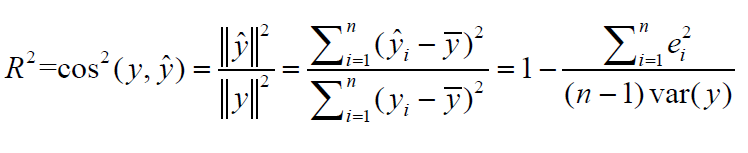

```{r}

setwd('D:/iCloud/iCloudDrive/Master Big Data/Data Analytics - Teoria_Practica/_r_exercises/5-Linear Regression')

BcnPisos = read.delim("bcn_pisos.txt")

library(ggplot2)
library(dplyr)
library(magrittr)
library(sampling)
```

### ***1. Enumere cuales son las hipótesis que asumimos al hacer una regresión múltiple entre una variable de respuesta y y unas variables predictoras, x1, ..., xp.***

### ***2. En un modelo de regresión, como se calcula y como se interpreta el coeficiente de determinación R2.***

R2 se interpreta como un coeficiente o proporcion de variabilidad de la variable de respuesta explicada por el modelo (en otras palabras, que tanto explica el vector de ajuste al vector respuesta).

Valores de R que se aproximen a:

-   1 son valores que considerablemente buenos, ya que la variable

-   entre 0.4 y 0.7 son medianos

-   menores a 0.4 son bajos

-   cercanos a 0 son inservibles.

Se calcula a través del coseno cuadrado entre la variable respuesta y la variable predictora, o lo que es lo mismo:

{width="376"}

### ***3. Lea el fichero "BCN_pisos.txt". Del fichero resultante seleccione 2/3 partes como muestra de training y la tercera parte restante como muestra test.***

```{r}
length = nrow(BcnPisos)
index = sample(1:length, length * 0.66)

setTraining = BcnPisos[index,]
setTest = BcnPisos[-index,]
```

### ***4. Con la muestra de training, efectúe la representación gráfica de la variable "Valor" respecto del resto de variables del fichero. Calcule la correlación entre la variable "Valor" y el resto de variables numéricas.***

```{r}
colorPalett = c("#99E47E", "#48BF84", "#439775", "#3C7A80", "#D65F65")

correlation = round(cor(setTraining$Valor, setTraining$Superf),3)

# Line Chart: Valor Medio Pisos

ValorChart = ggplot(setTraining, aes(y = Valor, x = Superf, group = 1)) + geom_point(color = "#48BF84", size =1.2) + geom_smooth(method='lm', se = FALSE) + theme(axis.text.x = element_text(angle = 90, vjust = 0.5, hjust=1)) + ggtitle(paste("Valor Pisos por Superficie, with a correlation: ", correlation)) + labs(y = "Valor Ptas", x = " Superf") + scale_fill_manual(values=colorPalett)

print(ValorChart)

cor(setTraining$Valor, setTraining$Superf)
```

### ***5. Efectúe la regresión simple de la variable "Valor" respecto de la "Superficie". A continuación añada a la regresión la variable "Número de dormitorios". Es significativa esta variable una vez que el modelo ya contiene la variable "Superficie".***

```{r}

regval = lm(Valor ~ Superf, data = setTraining)
regval2 = lm(Valor ~ Superf + Dorm, data = setTraining)

summary(regval2)
```

```{r}
anova(regval2)
```

```{r}
cor(setTraining$Superf, setTraining$Dorm)
```

Agregando la variable Dorm a nuestro modelo, nos da un F-value elevado en la tabla fisher y un P_value pequeño, lo cual nos indica que dicha variable puede aportar una ganancia significativa.

Sin embargo, al evaluar la correlación entre Sueprf y Dorm, observamos una correlación elevada, aportando evidencia sobre dormitorio como una variable redundante.

### ***6. Efectúe la regresión múltiple del "Valor" respecto el resto de variables del fichero "BCN_pisos".¿Le parece que alguna variable predictora es no significativa?.***

```{r}
library(olsrr)
regval6 = lm(Valor ~ ., data = setTraining)
summary(regval6)
```

```{r}
anova(regval6)
```

Observando los F-value y P_values, podemos considerar que las variables, ***Ascens, Reforma y Planta*** son variable no significativas.

### ***7. Encuentre la regresión óptima. ¿Cuál es el valor del R2 alcanzado?. ¿Y cuál el valor del R2 por validación cruzada "leave one out"?***

```{r}
bestval = ols_step_best_subset(regval6)
bestval
```

Utilizando el método de selección del modelo automático, podemos observar que la regresión óptima sucede con 10 regresores de las 12 variables en el data set ya que el predicted R2, a partir de los 10 regresores, no sufre ningún cambio alcanzando un valor de 0.9419 y el valor AIC entre los 10, 11 y 12 regresores, es más bajo utilizando las 10 variables, cuyo valor es 49511.4326.

De igual forma, en el nivel 10, se alcanza un R2 0.9455

Regresión Óptima:

[***Superf + Dorm + Banys + Edat + Estat + Dist + ValSol + Tipus + ExtInt + Reforma***]{.underline}

```{r}
regval7 = lm(Valor ~ Superf + Dorm + Banys + Edat + Estat + Dist + ValSol + Tipus + ExtInt + Reforma, data = setTraining)

summary(regval7)
```

```{r}
PRESS = sum((regval7$residuals/(1-ls.diag(regval7)$hat))^2)
R2loo = 1 - PRESS/(var(setTraining$Valor)*(1537-1))
cat("R2 por validación cruzada 'leave one out':",R2loo)
```

### ***8. Realice el análisis de los residuos. ¿Son normales los residuos?, ¿Existe alguna relación de dependencia con los valores ajustados?. ¿Existe heterocedasticidad?. ¿Existen observaciones influyentes?***

```{r}
plot(density(regval7$residuals), col=colorPalett[2])
```

```{r}
par(mfrow = c(2,2))
plot(regval7)
par(mfrow = c(1,1))
```

-   Los residuos se aproximan a una distribución normal de acuerdo a el gráfico Normal Q-Q.

-   Existe una relación lineal entre los valores ajustados de acuerdo a el gráfico Residuals vs Fitted.

-   Se observa heterocedasticidad en el gráfico Scale-Location por mostrar poca dispesión entre los puntos.

-   No se observan puntos influyentes que impliquen un cambio en el modelo en el gráfico Residual vs Leverage.

### ***9. Obtenga el valor del R2 de predicción en la muestra test.***

```{r}
pred = predict(regval7, newdata = setTest)
head(pred)

predSSE = sum((setTest$Valor-pred)^2)
R2test = 1 - predSSE/(var(setTest$Valor)*(792-1))
cat("R2test: ",R2test)
```

### ***10. Obtenga el fichero con las predicciones del valor de las viviendas con su intervalo de confianza del 95%, para los pisos de la muestra test.***

```{r}
pred_int = predict(regval7, newdata = setTest, interval = "confidence")
head(pred_int,30)
```
