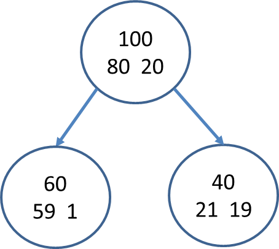

```{r setup, include=FALSE}
knitr::opts_chunk$set(echo = TRUE)
```

## Ejercicio 1

**Suponga el siguiente árbol simple *T* con sólo dos nodos (hojas) terminales. En el nodo raíz se tiene 100 individuos que se dividen en dos nodos hijos de 60 y 40 individuos cada uno. La variable de respuesta indica la compra (No o Si) de un cierto producto:**



**Calcule la reducción de impureza que se obtiene al pasar del nodo padre a los dos nodos hijos:**

Impureza de Gini de dos clases:

-   Raíz: i(t) = 2 \* 80 /100 \* 20 /100 = **0.32**

-   Hijo izquierda: i(t) = 2 \* 59 /60 \* 1 /60 = **0.032**

-   Hijo derecha: i(t) = 2 \* 21 /40 \* 19/40 = **0.0475**

Impureza hijos:

-   ∆i(t) = 0.32 - 60/100 \* 0.032 \* 40/100 \* 0.0475 = **0,00116**

## Ejercicio 2

**Con el mismo árbol precedente, calcule su coste de mal clasificación R(T).**

R(T) = 60/100 \* 0.032 + 40/100 \* 0.0475 = **0.0382**

## Ejercicio 3

**Retome los datos del problema churn. Se trata ahora de obtener un árbol de decisión que nos permita efectuar predicciones sobre la probabilidad de baja de los clientes. Cargue en R la Liberia rpart y obtenga un árbol máximo (cp=0.0001) con crossvalidación (xval=10). (Obsérvese que tomamos todos los datos (2000) como muestra de training y que en este problema no disponemos de muestra test)**

```{r}
library('rpart')
library('rpart.plot')
df = read.table("../8-Profiling/_repository/churn.txt",header=T, check.names = F)
modelo = rpart(df$Baja ~ ., data=df, control = rpart.control(cp = 0.0001, xval = 10))
plot(modelo)

```

## Ejercicio 4

**Determine ahora el árbol óptimo y su valor del complexity parameter (cp). Diga cuales son las variables más importantes en la definición del árbol óptimo.**

```{r}
printcp(modelo)
```

Al no tener datos de validación, se procede a realizar un ten-fold cross validation test, en el cual se calculan las medias (xerror) y sus respectivas desviaciones tipo (xstd). Una vez obtenido los resultados, se procede a buscar la medía mínima (xerror) sumando 1 desviación tipo para obtener un threshold de posibilidades de árboles óptimos y siguiendo un criterio de parsimonia, se elige el árbol más simple ya que es parte del criterio de selección es que los árboles deben ser interpretables.

Valor xerror mínimo: 0.385

Desviación tipo: 0.017632

Threshold: 0.402632

***En este caso, el árbol óptimo es cualquiera cuya media esté por debajo de los 0.402632, y por el criterio de parsimonia se elige el árbol con index 18, con un CP 0.00266667 y 31 Splits.***

## Ejercicio 5

**Represente gráficamente el árbol óptimo y liste sus reglas de decisión.**

```{r}
modelo_optimo = prune(modelo, cp = 0.00266667)
rpart.plot(modelo_optimo)
```

## Ejercicio 6

**A partir de la tabla de datos ponderados, decida un umbral de decisión para la predicción de "baja" y obtenga el "error_rate", la precisión en la predicción positiva y el Recall asociado al umbral escogido**

```{r}
```

## Ejercicio 7

**A partir de la tabla de datos ponderados, obtenga la curva ROC correspondiente.**

```{r}
```
